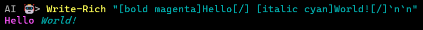
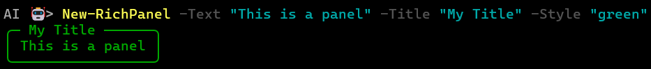
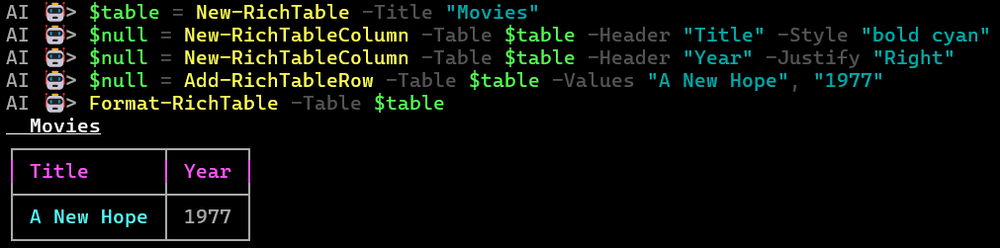
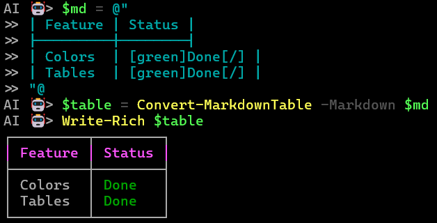

<div align="center">

</div>
<br/>
<br/>

# PowerShell Rich

A PowerShell port of the amazing [Textualize/rich](https://github.com/Textualize/rich) Python library. 

PowerShell Rich is a module for rich text and beautiful formatting in the terminal. It allows you to easily add color and style to your PowerShell scripts, and render complex data structures like tables, trees, and progress bars with ease.

## Features

- **Rich Text**: Use BBCode-like markup for colors and styles (e.g., `[bold red]Hello[/]`).
- **Panels**: Wrap content in beautiful boxes with titles.
- **Tables**: Create flexible, styled tables with column alignment and borders.
- **Trees**: Render hierarchical data with guide lines.
- **Columns**: Automatically arrange items into a grid.
- **Progress Bars**: Multi-task progress bars with live updates.
- **Status Spinners**: Background-threaded spinners for long-running tasks.
- **Layouts**: Split the terminal into regions for complex dashboards.
- **Markdown**: Convert Markdown tables directly into Rich tables.

## Installation

1. Clone this repository.
2. Import the module:
   ```powershell
   Import-Module ./PowerShellRich.psd1
   ```

## Quick Start

### Basic Styling
```powershell
Write-Rich "[bold magenta]Hello[/] [italic cyan]World![/]"
```


### Panels
```powershell
New-RichPanel -Text "This is a panel" -Title "My Title" -Style "green"
```


### Tables
```powershell
$table = New-RichTable -Title "Movies"
$null = New-RichTableColumn -Table $table -Header "Title" -Style "bold cyan"
$null = New-RichTableColumn -Table $table -Header "Year" -Justify "Right"
$null = Add-RichTableRow -Table $table -Values "A New Hope", "1977"
Format-RichTable -Table $table
```


### Progress Bars
```powershell
Start-RichProgress -ScriptBlock {
    $t = Add-RichProgressTask -Description "Downloading" -Total 100
    for ($i = 0; $i -le 100; $i += 10) {
        Update-RichProgress -Id $t -Completed $i
        Start-Sleep -Milliseconds 100
    }
}
```

### Markdown Tables
```powershell
$md = @"
| Feature | Status |
|---------|--------|
| Colors  | [green]Done[/] |
| Tables  | [green]Done[/] |
"@
$table = Convert-MarkdownTable -Markdown $md
Write-Rich $table
```


## Examples

Check the [Examples](./Examples/) directory for comprehensive demonstrations of all features.

## License

MIT
